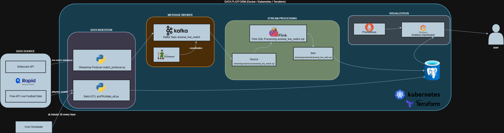
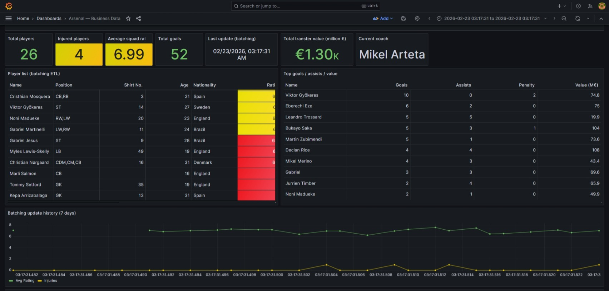

<div align="center">
  
  
  # ArsenalStats: Real-time & Batch Data Pipeline for Arsenal FC
  
  
  
  
  
  
  
</div>

## Table of Contents

- [Introduction](#introduction)
- [List of Features](#list-of-features)
- [Technologies Used](#technologies-used)
  - [Core Languages & Frameworks](#core-languages--frameworks)
  - [Infrastructure & Tools](#infrastructure--tools)
- [API References](#api-references)
- [System Architecture](#system-architecture)
- [Installation & Usage (Docker + Terraform)](#installation--usage-docker--terraform)
  - [Prerequisites](#prerequisites)
  - [1) Clone the repository](#1-clone-the-repository)
  - [2) Configure environment variables](#2-configure-environment-variables)
  - [3) Local run with Docker Compose](#3-local-run-with-docker-compose)
  - [4) Access Grafana Dashboards](#4-access-grafana-dashboards)
  - [5) Infrastructure provisioning with Terraform](#5-infrastructure-provisioning-with-terraform)

## Introduction

ArsenalStats is an end-to-end football data platform focused on Arsenal FC. It ingests data from RapidAPI sources, processes both live and scheduled workloads, and publishes analytics-ready datasets for monitoring and business dashboards

The project uses a **hybrid architecture** with two complementary pipelines:

1. **Streaming pipeline**: A Python producer collects live match events, publishes them to Kafka, and Flink SQL transforms the stream into structured match statistics stored in PostgreSQL
2. **Batch pipeline**: A scheduled ETL job periodically fetches squad and coach metadata, then upserts curated records into PostgreSQL dimension tables

On top of the data layer, Prometheus and Grafana provide observability and KPI visualization, while Docker Compose and Terraform enable reproducible local and Kubernetes-based deployments

## List of Features

- **Real-time Event Processing**: Low-latency processing of live match metrics (possession, shots, cards,...)

- **Automated ETL:** Scheduled ingestion of player and coach metadata from external APIs

- **Infrastructure as Code (IaC):** Entire cloud-ready infrastructure (Kafka, Flink, Zookeeper, Postgres) provisioned via Terraform

- **Containerized Orchestration:** Standardized development and deployment environment using Docker Compose

- **Relational Modeling:** Structured PostgreSQL schema with triggers for data integrity

## Technologies Used

### Core Languages & Frameworks

- Python 3.11: Primary language for ETL logic and data producers

- Apache Kafka: Distributed message broker for the streaming backbone

- Apache Flink: Stream processing engine for real-time transformations

- PostgreSQL: Relational data warehouse for storing processed metrics

### Infrastructure & Tools

- Terraform: For infrastructure provisioning and state management

- Docker & Docker Compose: For service containerization and isolation

## API References

The project integrates with two high-fidelity football data providers via [RapidAPI](https://rapidapi.com/hub)

| Source            | Endpoint Host                                | Purpose                                               | Team ID |
| ----------------- | -------------------------------------------- | ----------------------------------------------------- | ------- |
| SofaScore API     | `sofascore.p.rapidapi.com`                   | Live match statistics, schedules, and scores          | `42`    |
| Football Data API | `free-api-live-football-data.p.rapidapi.com` | Detailed player profiles, squad lists, and coach info | `9825`  |

> [!NOTE]
> Access requires a valid `RAPIDAPI_KEY` stored in a `.env` file

## System Architecture



The diagram above reflects a **hybrid pipeline**: real-time streaming for live match events and scheduled batch ETL for squad metadata

### 1) Data Sources

- **SofaScore API** (`sofascore.p.rapidapi.com`) provides live fixture and in-match statistics for Arsenal (team id `42`)
- **Free API Live Football Data** (`free-api-live-football-data.p.rapidapi.com`) provides squad/coach/player profile data (team id `9825`)

### 2) Ingestion Layer

- **Streaming producer** in `streaming/code/producer/match_producer.py`:
  - Detects live Arsenal fixtures
  - Pulls match statistics every ~10 seconds while match is in progress
  - Publishes JSON events to Kafka topic `arsenal_live_match`
  - Upserts fixture status into `arsenal_stats.match` in PostgreSQL

- **Batch ETL job** in `batching/code/arsPRJ/data_etl.py`:
  - Fetches squad and coach data from RapidAPI
  - Parses/normalizes player and coach attributes
  - Upserts into `arsenal_stats.players` and `arsenal_stats.coach`

- **Scheduler**:
  - Cron configuration at `batching/schedule/crontab` executes ETL at minute `30` every hour

### 3) Message Broker & Stream Processing

- **Kafka + ZooKeeper** are the event backbone (`docker-compose.yml`, `terraform/kafka.tf`)
- Flink job in `streaming/code/match_stream.py` loads SQL DDL/DML templates and runs a statement set:
  - Source table: `streaming/code/source/arsenal_live_match.sql` (Kafka JSON source)
  - Process SQL: `streaming/code/process/arsenal_live_match.sql` (field mapping/transformation)
  - Sink table: `streaming/code/sink/arsenal_match_stats.sql` (JDBC sink to PostgreSQL)

### 4) Storage Layer (PostgreSQL)

Schema and objects are initialized from:

- `postgesql/create_table.sql`
- `postgesql/trigger.sql`

Main analytical entities:

- `arsenal_stats.match`: fixture metadata + lifecycle status (`notstarted`, `inprogress`, `finished`)
- `arsenal_stats.arsenal_match_stats`: time-series live match statistics from Flink
- `arsenal_stats.players`, `arsenal_stats.coach`: batch-enriched squad dimension data

### 5) Monitoring & Visualization

- **Prometheus** scrapes Kafka/JMX, Kafka Exporter, Postgres Exporter, and Flink metrics
- **Grafana** dashboards in `grafana/dashboards` visualize both:
  - Business KPIs (squad, injuries, ratings, transfer value)
  - Streaming KPIs (live match status, possession/shots trends, ingestion freshness)

### 6) Runtime & Deployment Model

- **Local runtime**: `docker-compose.yml` orchestrates Zookeeper, Kafka, Flink, Producer, Batch ETL, Postgres, Prometheus, Grafana
- **IaC runtime**: Terraform (`terraform/*.tf`) provisions Kubernetes namespace/workloads, monitoring stack (Helm `kube-prometheus-stack`), persistent volumes, and secrets-driven app configuration

### End-to-End Flow

1. APIs → Producer/ETL pull data
2. Producer → Kafka topic `arsenal_live_match`
3. Flink SQL → consumes Kafka and writes curated rows to PostgreSQL
4. Batch ETL → periodically upserts squad/coach dimensions to PostgreSQL
5. Grafana/Prometheus → expose operational and business insights to end users

## Dashboards

### Arsenal — Business Data



- **Total Players**: Count of roster players (excluding coaches)
- **Injured Players**: Number of players currently injured with color thresholds
- **Average Squad Rating**: Mean player rating with green/yellow/red zones
- **Total Goals**: Aggregate goals scored by all players
- **Transfer Value**: Total market value in million €
- **Last Update**: Most recent batching ETL timestamp
- **Current Coach**: Manager name
- **Player List**: Detailed roster with position, age, nationality, stats, injury status, and market value
- **Batching History**: 7-day trend of average ratings and injuries

### Streaming Match Statistics


- **Total Matches Stored**: Cumulative match records in database
- **Live Now**: Currently active matches (0 or 1)
- **Finished Matches**: Completed fixtures
- **Match Stats Records**: Real-time statistics entries
- **Last Match Stats Update**: Most recent streaming update timestamp
- **Fixtures**: Latest 20 upcoming and completed matches with status
- **Match Stats**: Live possession, shots, cards, fouls, corners bar charts
- **Possession Trend**: Time-series of possession % over match duration
- **Shots Trend**: Time-series of shot counts and accuracy

## Installation & Usage (Docker + Terraform)

### Prerequisites

- Docker Desktop
- Docker Compose
- Python 3.11+
- Terraform CLI
- RapidAPI key (`RAPIDAPI_KEY`)

### 1) Clone the repository

```bash
git clone https://github.com/phamkhanhduy669/arsenalStats.git
cd arsenalStats
```

### 2) Configure environment variables

Create a `.env` file at the project root (required for local Docker run):

```env
RAPIDAPI_KEY=your_rapidapi_key
```

Use one of the templates below only when you need custom DB credentials or Terraform provisioning

Template A — `.env` (for local Docker runs):

```env
RAPIDAPI_KEY=your_rapidapi_key
DB_HOST=localhost
DB_PORT=5432
DB_NAME=project_1
DB_USER=postgres
DB_PASSWORD=your_postgres_password
```

Template B — `terraform/terraform.tfvars` (for Terraform provisioning):

```hcl
rapidapi_key      = "your_rapidapi_key"
postgres_password = "your_postgres_password"
postgres_user     = "postgres"
postgres_db       = "project_1"
```

Template C — PowerShell env vars (alternative to `terraform.tfvars`):

```powershell
$env:TF_VAR_rapidapi_key="your_rapidapi_key"
$env:TF_VAR_postgres_password="your_postgres_password"
$env:TF_VAR_postgres_user="postgres"
$env:TF_VAR_postgres_db="project_1"
```

### 3) Local run with Docker Compose

Start core services:

```powershell
docker compose up -d --build
```

Check service status:

```powershell
docker compose ps
docker compose logs -f producer batching_etl flink-job-submitter
```

Stop services:

```powershell
docker compose down
```

### 4) Access Grafana Dashboards

1. Open Grafana: `http://localhost:3000`
2. Login with default credentials:

- Username: `admin`
- Password: `admin`

3. Navigate to **Dashboards** and open one of these provisioned dashboards:

- `arsenal_data.json` (business metrics)

> [!TIP]
> If a panel shows **No data**, wait 1-2 minutes after startup and refresh the dashboard. The producer and ETL jobs need time to ingest initial records

### 5) Infrastructure provisioning with Terraform

Provision infrastructure from the `terraform` directory:

```powershell
cd .\terraform
terraform init
terraform plan -out tfplan
terraform apply tfplan
```

Destroy provisioned resources when no longer needed:

```powershell
terraform destroy
```
